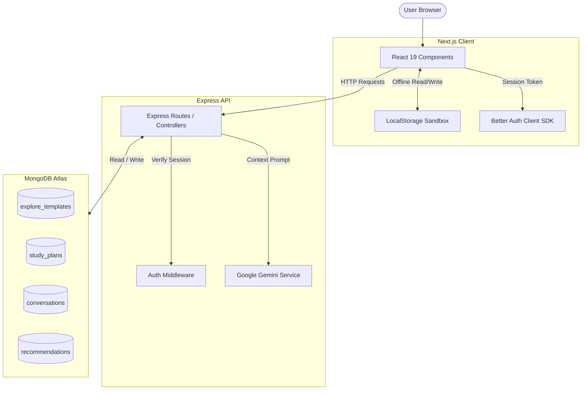
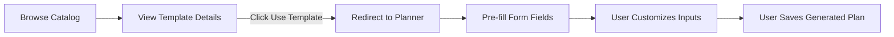
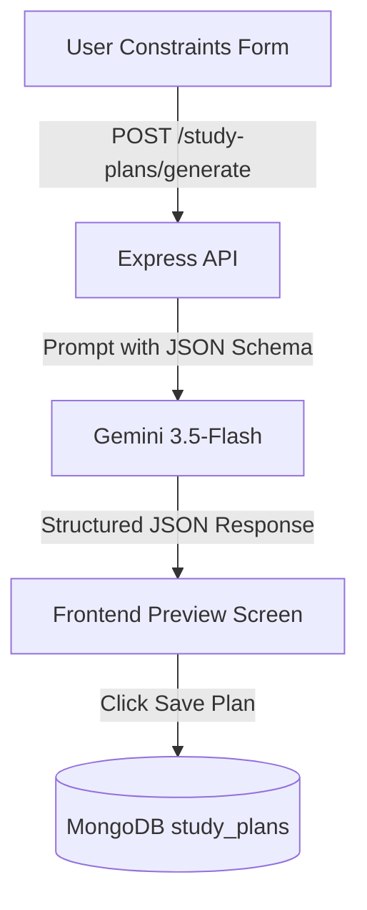
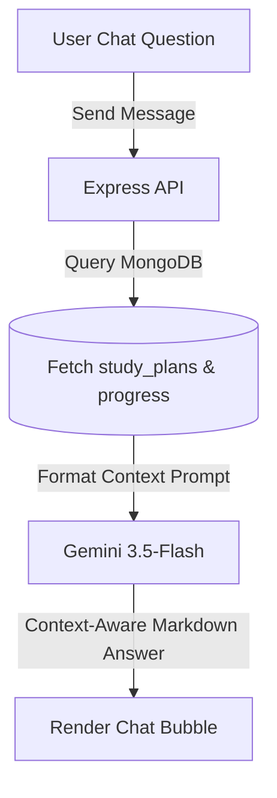
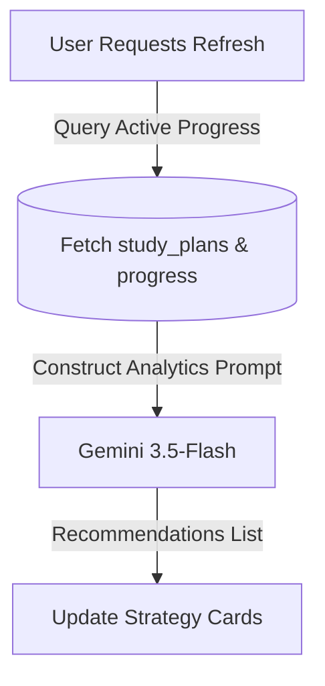
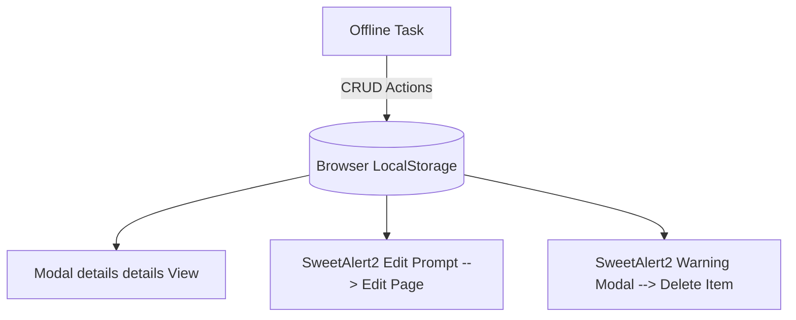

# StudyPilot AI — Frontend Client

[](https://nextjs.org)
[](https://www.typescriptlang.org)
[](https://tailwindcss.com)
[](https://opensource.org/licenses/MIT)

StudyPilot AI is a premium, full-stack, Agentic AI-powered personalized study planning and academic assistance ecosystem. This repository houses the high-performance Next.js frontend application, built with React 19, TypeScript, and Tailwind CSS. It connects to the Express REST API backend and MongoDB Atlas persistence layers to deliver custom roadmaps, checklists, real-time progress charts, context-aware AI Tutoring, and adaptive study recommendations.

---

## Table of Contents
- [1. Project Architecture & Ecosystem Positioning](#1-project-architecture--ecosystem-positioning)
- [2. System Architecture & Flows](#2-system-architecture--flows)
- [3. Key Features](#3-key-features)
- [4. Agentic AI Integration](#4-agentic-ai-integration)
- [5. Application Workflows](#5-application-workflows)
  - [Explore & Use Reference Blueprints](#explore--use-reference-blueprints)
  - [AI Study Planner Generation](#ai-study-planner-generation)
  - [AI Tutor Interaction](#ai-tutor-interaction)
  - [Adaptive Recommendations](#adaptive-recommendations)
  - [My Items Supporting Sandbox](#my-items-supporting-sandbox)
- [6. Technology Stack](#6-technology-stack)
- [7. Folder Structure & Pages](#7-folder-structure-&-pages)
- [8. Environmental Variables](#8-environmental-variables)
- [9. Local Setup & Installation](#9-local-setup--&-installation)
- [10. Production Builds & Verification](#10-production-builds-&-verification)
- [11. Assignment Compliance Matrix](#11-assignment-compliance-matrix)
- [12. Known Limitations & Roadmap](#12-known-limitations-&-roadmap)

---

## 1. Project Architecture & Ecosystem Positioning

StudyPilot AI is designed around a singular core experience: helping students dynamically structure their learning.

```
┌────────────────────────────────────────────────────────────────────────┐
│                          STUDYPILOT AI PORTAL                          │
├───────────────────────────────────┬────────────────────────────────────┤
│       PRIMARY CORE ECOSYSTEM      │    SUPPORTING ASSIGNMENT MODULE    │
│  (MongoDB + Gemini Agentic Loops) │  (Browser LocalStorage Sandbox)    │
│                                   │                                    │
│   - Explore Templates Catalog     │   - My Items Standalone Tracker    │
│   - AI Personalized Planner       │   - Add, Edit, Delete Sandbox      │
│   - Real-time Dashboard Charts    │   - SweetAlert2 Confirmation Modals│
│   - Context-Aware Tutor Chat      │   - Decoupled from MongoDB Sync    │
│   - Adaptive AI Recommendations   │                                    │
└───────────────────────────────────┴────────────────────────────────────┘
```

* **The Core Platform**: Establishes a synchronized learning loop where a user's active plans and progress checklists (persisted in MongoDB) feed the AI Tutor and Recommendation engines.
* **The Supporting Sandbox (My Items)**: Operates strictly offline as a standalone task tracker utilizing `localStorage`. This separation keeps offline notes and raw checklist templates distinct from verified study data, ensuring AI models process only verified plans.

---

## 2. System Architecture & Flows

### Overall System Architecture


---

## 3. Key Features

* **Advanced Authentication**: Custom credential login/registration forms and Google OAuth sign-in managed via Better Auth. Supported by a demo credential auto-fill bypass.
* **Explore Catalog**: Dynamic blueprints library with category filters, difficulty tags, text search, custom sorting, and pagination.
* **AI Study Planner**: Custom roadmap generator producing granular phase tasks based on timelines and daily capacities.
* **Responsive Dashboard**: Real-time progress trackers, bar charts, and interactive task lists linked directly to MongoDB.
* **Context-Aware AI Tutor**: Interactive chat assistant that queries active MongoDB study plans to guide conversation threads.
* **AI Recommendation Engine**: Scans checklists and identifies weak topics to suggest study strategies.
* **My Items Sandbox**: Decoupled standalone list supporting add, edit, and delete operations with custom styled SweetAlert2 confirmation modals.

---

## 4. Agentic AI Integration

StudyPilot AI implements an agent-like architecture that prioritizes reasoning over static outputs:

* **Context Integration**: Prompt contexts are enriched with database records (active plans, completion ratios, weak topics).
* **Structured Outputs**: Gemini enforces structured JSON outputs (`responseMimeType: "application/json"` + strict schema constraints), reducing parsing exceptions.
* **Cognitive Decision Support**: The AI calculates preparation time boundaries, organizes complex schedules, and recommends targets.

---

## 5. Application Workflows

### Explore & Use Reference Blueprints
Explore templates serve as starting points. Clicking **"Use This Template"** does not directly write to the database. Instead, parameters are passed to the planner form to populate setup options.



### AI Study Planner Generation
The planner calls the backend with target constraints, prompting Gemini to output a structured JSON plan containing roadmaps, tasks, daily schedules, and revision strategies.



### AI Tutor Interaction
The Tutor parses conversation threads and checks active study plans in MongoDB to provide relevant academic guidance.



### Adaptive Recommendations
Analyzes checklist completion rates in MongoDB to return prioritized study recommendations.



### My Items Supporting Sandbox
Manages local items independently of the core database.



---

## 6. Technology Stack

* **Framework**: Next.js 16.2.10 (App Router, Turbopack enabled)
* **Runtime & Logic**: React 19.2.4, TypeScript 5.x
* **CSS & Transitions**: Tailwind CSS v4.0, Framer Motion 12.4
* **Forms & Verification**: React Hook Form 7.81, Zod 4.4
* **Auth**: Better Auth Client SDK 1.6
* **Notifications**: SweetAlert2, React Toastify 11.1
* **Analytics**: Recharts 3.9
* **Iconography**: Lucide React 1.25

---

## 7. Folder Structure & Pages

```
studypilot-ai-client/
├── public/                 # Static asset images
└── src/
    ├── app/                # Pages and layouts (App Router)
    │   ├── (auth)/         # Public Authentication flows (login, register)
    │   ├── (protected)/    # Protected features (dashboard, planner, assistant, recommendations)
    │   │   ├── items/      # My Items Sandbox views (manage, add, edit)
    │   │   └── page.tsx    # Dashboard entry-point
    │   ├── about/          # Static public details page
    │   ├── contact/        # Support ticket submit form
    │   ├── layout.tsx      # Main wrapper (Header, Footer, Provider hooks)
    │   └── page.tsx        # Styled landing page
    ├── components/         # Global shared UI elements (Button, Input, Card, Modal, Dropdowns)
    ├── features/           # Modularized domain logic blocks (items lists, planner wizard, tutor chat)
    ├── hooks/              # Custom React state hooks (useItems)
    ├── lib/                # API communication clients and better-auth initializers
    ├── schemas/            # Form validations configurations (Zod item schemas)
    ├── services/           # Decoupled mock database logic for My Items (localStorage operations)
    ├── types/              # TS interface configurations
    └── utils/              # Color constants, notifications styling helpers
```

---

## 8. Environmental Variables

Create a `studypilot-ai-client/.env.local` configuration file:
```env
NEXT_PUBLIC_API_URL=http://localhost:5000
NEXT_PUBLIC_BETTER_AUTH_URL=http://localhost:3000
```
* **NEXT_PUBLIC_API_URL**: Endpoint targeting the backend server instance.
* **NEXT_PUBLIC_BETTER_AUTH_URL**: Origin address of the Better Auth clients framework.

---

## 9. Local Setup & Installation

1. Clone the client repository and navigate to the project directory.
2. Install npm dependencies:
   ```bash
   npm install
   ```
3. Configure the `.env.local` variables file.
4. Run the local development server:
   ```bash
   npm run dev
   ```
5. View the client dashboard by loading [http://localhost:3000](http://localhost:3000) in your browser.

---

## 10. Production Builds & Verification

Before deployment, compile and verify the build locally:
```bash
# Verify type consistency
npx tsc --noEmit

# Compile production-ready bundle
npm run build

# Start optimized production server
npm run start
```

---

## 11. Assignment Compliance Matrix

| Requirement | Implementation Page / File | Fulfills Criteria |
| --- | --- | --- |
| **Search / Filters (2+)** | [page.tsx](file:///c:/project/Study-Pilot-AI/studypilot-ai-client/src/app/explore/page.tsx) | Dynamic category and difficulty filters with real-time text query search. |
| **Authentication Flow** | [page.tsx](file:///c:/project/Study-Pilot-AI/studypilot-ai-client/src/app/(auth)/login/page.tsx) | Implements Better Auth credentials setup and demo auto-fill bypass. |
| **Sandbox CRUD** | [ManageItemsList.tsx](file:///c:/project/Study-Pilot-AI/studypilot-ai-client/src/features/items/ManageItemsList.tsx) | Handles offline storage task mutations using warning dialogs. |
| **Agentic AI Models** | `planner/page.tsx`, `assistant/page.tsx`, `recommendations/page.tsx` | Connects planner forms, interactive chat, and recommendations. |

---

## 12. Known Limitations & Roadmap

- **Offline Offline-Sync**: My Items is locally cached. Future updates will sync offline local-storage entries with MongoDB collections when a connection is established.
- **Dynamic File Processing**: Extend AI Tutor context by allowing users to upload text documents and lecture slides.
- **Calendar Integration**: Connect schedules directly to Google Calendar and Microsoft Outlook APIs.
