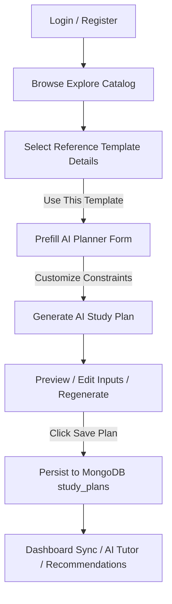

# StudyPilot AI (Frontend Client)

StudyPilot AI is a state-of-the-art educational SaaS platform designed to deliver personalized, adaptive study scheduling and interactive tutoring. Powered by Gemini, the platform dynamically generates tailored study roadmaps, manages tasks, offers recommendations, and provides context-aware tutoring.

This repository contains the Next.js frontend client codebase.

---

## Table of Contents
1. [Project Overview](#project-overview)
2. [Data Separation Model](#data-separation-model)
3. [Key Features](#key-features)
4. [Agentic AI Architecture](#agentic-ai-architecture)
5. [AI Study Planner](#ai-study-planner)
6. [AI Tutor](#ai-tutor)
7. [AI Recommendation Engine](#ai-recommendation-engine)
8. [Dashboard Overview](#dashboard-overview)
9. [Authentication & Security](#authentication--security)
10. [Technology Stack](#technology-stack)
11. [Frontend Folder Architecture](#frontend-folder-architecture)
12. [Environment Variables](#environment-variables)
13. [Local Development](#local-development)
14. [Production Build](#production-build)
15. [Deployment](#deployment)
16. [Assignment Compliance](#assignment-compliance)
17. [Future Roadmap](#future-roadmap)

---

## Project Overview

StudyPilot AI bridges the gap between structured academic programs and individual study schedules. Using AI, it adapts reference curriculums into granular study roadmaps based on the user's timelines, available study hours, and weak topics.

### Complete User Journey


1. **Auth**: The user registers or signs in using credentials or demo credentials.
2. **Explore**: User browses standard templates (Computer Science, Mathematics, Humanities, etc.).
3. **Template Blueprint**: Selecting a template pre-fills the AI Planner with subject parameters.
4. **AI Generation**: User customizes time, weak topics, and timeline goals, and Gemini generates a structured JSON roadmap.
5. **MongoDB Sync**: Saving the plan dynamically updates Dashboard statistics, provides context to the AI Tutor, and feeds the Recommendation Engine.

---

## Data Separation Model

StudyPilot AI enforces strict separation between three concepts to prevent data overlap and maintain system integrity:

| Data Type | Persistence Layer | Scope | Connection to AI Features |
| --- | --- | --- | --- |
| **Explore Templates** | MongoDB Atlas (`explore_templates`) | Public / Shared | Acts as a blueprint to pre-fill the AI Planner form. Cannot be completed. |
| **AI Study Plans** | MongoDB Atlas (`study_plans`) | Private / User-specific | Directly feeds the Dashboard charts, AI Tutor context, and Recommendation Engine. |
| **My Items Sandbox** | Browser `localStorage` | Private / Offline Sandbox | Completely offline standalone list. Not connected to MongoDB, Dashboard, Tutor, or Recommendations. |

---

## Key Features

* **User Authentication**: credential login, sign-up, Google OAuth integration, and session tracking via Better Auth.
* **Explore Catalog**: Dynamic templates directory with search, category filtering, difficulty badges, sorting (newest, oldest, highest-rating, most-tasks), and page pagination.
* **AI Study Planner**: Custom timeline study plan generation, full preview states, regeneration triggers, and save functionalities.
* **Dashboard Widgets**: Dynamic charts (Recharts) and checklists reflecting active MongoDB study plan tasks and completions.
* **AI Tutor Chat**: Interactive context-aware tutor that dynamically checks active study plans in MongoDB to prioritize study guidelines.
* **Recommendations**: Studies scheduler recommendations analyzing task completeness rates.
* **My Items offline Sandbox**: Add, View modal details, Edit (with SweetAlert2 prompt), and Delete (with SweetAlert2 warning modal) offline items.

---

## Agentic AI Architecture

StudyPilot AI employs an agent-like reasoning loop:
1. **Context Awareness**: The AI reads active checklists, timelines, and weak topics from MongoDB.
2. **Dynamic Decision-Making**: Rather than returning static outlines, the AI calculates remaining preparation days, splits the roadmap into logical, paced study phases, and budgets daily study tasks.
3. **Structured Outputs**: Gemini enforces structured JSON shapes (`responseSchema`), preventing format parsing anomalies.

---

## AI Study Planner

* **Redirection Prefill**: Passes search parameters directly into the planner form.
* **Schema Verification**:
  ```json
  {
    "roadmap": [
      {
        "phaseName": "Phase 1: Basic Fundamentals",
        "tasks": [
          { "id": "task-1", "title": "Review core concepts", "description": "Read introductory chapters", "estimatedHours": 3 }
        ]
      }
    ],
    "dailySchedule": ["Monday review", "Wednesday practice"],
    "revisionStrategy": "Weekly spaced retrieval practice instructions"
  }
  ```
* **Enforced JSON constraints**: Uses Gemini's `responseMimeType: "application/json"` and `responseSchema` parameters to guarantee structured JSON output.
* **Compatibility Fallbacks**: Handles legacy plain-text study plan descriptions gracefully without crashing the UI.

---

## AI Tutor

The AI Tutor loads the user's active roadmaps and tasks into the prompt. The tutor understands completed tasks, overdue exam timelines, and weak topics, answering questions like:
- *"What should I focus on next?"*
- *"What tasks have I completed so far?"*
- *"Explain the concepts of my current study plan."*

---

## AI Recommendation Engine

Analyzes the student's task completion progress, identifies plans that are falling behind, highlights incomplete weak topics, and generates specific recommended actions with estimated study durations.

---

## Explore Catalog

Seeded with 100 canonical templates. View Details dynamically loads details and filters related template guides based on category tags while excluding the active template ID.

---

## My Items — Offline Sandbox

Decoupled sandbox using `localStorage`. Actions are guarded by custom styled **SweetAlert2** modals:
- **Edit**: Prompts confirmation modal before entering `/items/edit/[id]`.
- **Delete**: Prompts warning confirmation modal before removal.
- **View**: Launches an overlay details Modal showing full description text and priority badges.

---

## Dashboard

Dynamic metrics calculated in real-time from active MongoDB records:
- Total and active plans count.
- Task completion rates.
- Recharts bar graphs.
- Direct quick-links to Planner, Chat, and Explore routes.

---

## Authentication & Security

* Session validation on both client and server layers.
* Better Auth configuration handles CSRF checks and JWT/cookies verification.
* Enforced route security: Unauthorized requests to `/dashboard` or `/planner` redirect to `/login`.

---

## Technology Stack

* **Core**: Next.js 15+ (App Router), React 19, TypeScript
* **Styling**: Tailwind CSS, SweetAlert2, React Toastify, Lucide Icons
* **Forms**: React Hook Form, Zod Resolver
* **Charts**: Recharts

---

## Frontend Folder Architecture

```
studypilot-ai-client/
├── public/                 # Static assets
└── src/
    ├── app/                # Next.js App Router (pages & layouts)
    │   ├── (auth)/         # Login, registration pages
    │   ├── (protected)/    # Dashboard, planner, items, tutor pages
    │   ├── about/          # Public About page
    │   └── contact/        # Public Contact page
    ├── components/         # Shared global UI elements (Button, Card, Input, Modal, Navbar)
    ├── features/           # Feature modules (dashboard, items, study-planner, tutor-chat)
    ├── hooks/              # Custom hooks (useItems, session hooks)
    ├── lib/                # API client configuration & Auth client SDK
    ├── schemas/            # Form validation definitions (Zod)
    ├── services/           # Decoupled mock database service (itemService)
    ├── types/              # TypeScript declarations
    └── utils/              # Tailwind utilities, notifications managers
```

---

## Environment Variables

Create a `studypilot-ai-client/.env.local` file:
```env
NEXT_PUBLIC_API_URL=http://localhost:5000 # Express backend endpoint
NEXT_PUBLIC_BETTER_AUTH_URL=http://localhost:3000 # Better Auth base URL
```

---

## Local Development

1. **Install dependencies**:
   ```bash
   npm install
   ```
2. **Start development server**:
   ```bash
   npm run dev
   ```
3. **Typecheck verification**:
   ```bash
   npx tsc --noEmit
   ```
4. **Compile production build**:
   ```bash
   npm run build
   ```

---

## Production Build

To build and run the optimized client in production:
```bash
npm run build
npm run start
```

---

## Deployment

The frontend client is optimized for deployment on **Vercel** with automatic serverless functions mapping.

---

## Assignment Compliance

This client implements the requirements of the SCIC-13 Assignment 5, including public catalogs, search, filtering (2+ parameters), sorting, numeric pagination, authentication (Better Auth + Demo login fill), protected routes, items sandbox (View, Edit, Delete with SweetAlert2 confirmation dialogs), and 3 substantial Agentic AI features.

---

## Future Roadmap

- Support offline-sync for MongoDB study plans during network outages.
- Provide custom calendar sync (Google Calendar, Outlook) for study events.
- Allow file attachments (PDFs, images) inside My Items for quick notes.
